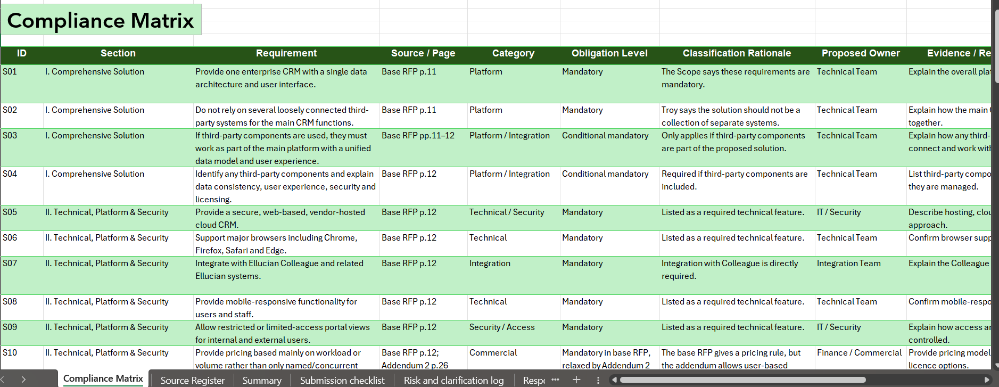

# RFP Compliance & Response Readiness Case Study

## Project Overview

This individual portfolio project is based on Troy University RFP #26-004 for Customer Relationship Management (CRM) Software.

The main purpose of this project was to understand how a business analyst or proposal analyst would review a complex RFP, organise requirements properly, identify submission obligations, track risks and clarifications, and create a structured response-readiness framework.

## What I Did

I reviewed the base RFP and official addenda and converted the information into a structured analysis workbook.

The project includes:

- Compliance Matrix
- Source Register
- Submission Checklist
- Risk & Clarification Log
- Response Plan
- Opportunity Brief
- Executive Summary

Requirements were classified by type and obligation level, linked to their source pages, assigned proposed response owners, and reviewed for the evidence or information that would be required from a real vendor.

Where information was unavailable, I recorded it as requiring vendor input or clarification instead of assuming or inventing information.

## Key Skills Demonstrated

Requirements analysis, RFP analysis, compliance tracking, risk identification, documentation, response planning, stakeholder coordination and Microsoft Excel.

## Project Deliverables

- [RFP Response Readiness Analysis Workbook](RFP_Response_Readiness_Analysis.xlsx)
- [Opportunity Brief](Opportunity_Brief.pdf)
- [Executive Summary](Executive_Summary.pdf)

## Important Note

This is an independent learning and portfolio case study based on a publicly available RFP. I was not employed by Troy University or by a bidding vendor, and this project was not part of an actual submitted proposal.

No fictional vendor capabilities, pricing, certifications or compliance claims were created.
